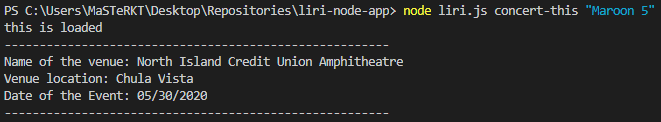
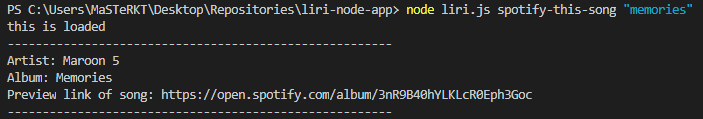
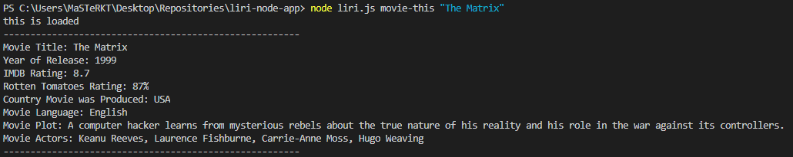
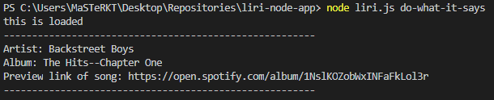

# LIRI-Bot

## Introduction

LIRI-Bot is a Node app. LIRI will search Spotify for songs, Bands in Town for concerts, and OMDB for movies. LIRI is like iPhone's SIRI. However, while SIRI is a Speech Interpretation and Recognition Interface, LIRI is a Language Interpretation and RecognitionInterface. LIRI is a command line node app that takes in parameters provided by the user and gives back data requested. 

## LIRI Setup

1. Clone the repository
2. Run npm install. This will install the 4 following packages...

    * Node-Spotify-API

    * Axios (This module will be used to get the IMDB and BandsInTown API data)
    
    * Moment

    * DotENV

3. Create a .env file in the same directory as the rest of the files. In the .env file please add the following -

    **# Spotify API keys**

    **SPOTIFY_ID=your-spotify-ID-here**

    **SPOTIFY_SECRET=your-spotify-secret-here**

    * **The Spotify API requires you sign up as a developer to generate the necessary credentials. You can follow these steps in order to generate a client id and client secret:**

    * Step One: Visit https://developer.spotify.com/my-applications/#!/

    * Step Two: Either login to your existing Spotify account or create a new one (a free account is fine) and log in.

    * Step Three: Once logged in, navigate to https://developer.spotify.com/my-applications/#!/applications/create to register a new application to be used with the Spotify API. You can fill in whatever you'd like for these fields. When finished, click the "complete" button.

    * On the next screen, scroll down to where you see your client id and client secret. Place these keys in your .env file as specified above. 

## LIRI Function

These are the functions available to run to pull data.

    * concert-this

    * spotify-this-song

    * movie-this

    * do-what-it-says

## How to use the above functions in your terminal to pull data.

* **node liri.js concert-this 'concert or band name'**

This will show the following information about each concert event to your terminal/bash window.

    * Name of the Venue

    * Location of the Venue

    * Date of the Venue

*  **node liri.js spotify-this-song 'song name'**

This will show the following information about each song in your terminal/bash window.

    * Artist(s)

    * The song's name

    * A preview link of the song from Spotify

    * The album that the song is from

* **node liri.js movie-this 'movie name'**

This will show the following information about each movie in your terminal/bash window.

    * Title of the Movie

    * Year the Movie was Released

    * The IMDB Rating

    * Country the Movie was made in

    * Language the Movie is in

    * Plot of the Movie

    * Actors in the Movie

    * The Rotten Tomatoes Rating

    * If no movie is provided then the movie "Mr. Nobody." will be searched instead.

* **node liri.js do-what-it-says**

This will take the text inside of random.text and use it to call the first command with the part as it's parameter.

    * Currently in random.txt, the following is listed.

        spotify-this-song,"I Want it That Way"

This would call the spotify-this-song function and pass in "I Want is That Way" as the song for search. 

## Screen Shots

#### concert-this command example

#### spotify-this-song command example

#### movie-this command example

#### do-what-it-says command example

## Link to repository

### **[LIRI Bot](https://github.com/hungle913/liri-node-app.git)**

## Technologies Used

* GitHub - File Repository

* Visual Studio Code - Text Editor

* NodeJS

* JavaScript

**APIs:**

* **Spotify** (https://developer.spotify.com/dashboard/)

* **NPM Spotify API** (https://www.npmjs.com/package/node-spotify-api)

* **OMDB API** (http://www.omdbapi.com/)

* **Bands In Town API** (http://www.artists.bandsintown.com/bandsintown-api)

**NPM Packages:**

* **NPM Axios** (https://www.npmjs.com/package/axios)

* **NPM Moment** (https://www.npmjs.com/package/moment)

* **NPM DotEnv** (https://www.npmjs.com/package/dotenv)

## Author

- **Hung Le**